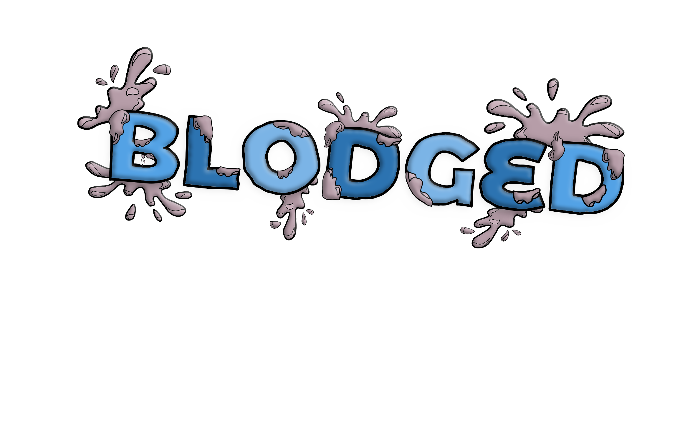

# $${\color{gold}Welcome}$$ $${\color{white}to}$$ $${\color{lightblue}Blodged}$$

This project is a continuation of the group application built in CST-339 (Java III) at Grand Canyon University. My goal for this continuation is to update the current structure to fit a communication website specifictally for coders with real-time updates on post, replies, and follows! I also plan to add daily coding challenges and other fun features to keep users intertained!

## Frontend Layout
```
src/
  assets/
  components/
    common/         # Reusable UI components (Button, Modal, etc.)
    posts/          # Post-related components
    user/           # User profile, settings, etc.
    notifications/  # Notification components
  pages/
    Home.vue
    Login.vue
    Register.vue
    Settings.vue
    Admin.vue
    Messages.vue
    NotFound.vue
  router/
    index.ts
  store/
    index.ts        # Pinia or Vuex store setup
  api/
    index.ts        # API request functions
  App.vue
  main.ts
```

## Backend Layout
```
Backend/
└── blodged-backend/
    ├── pom.xml
    └── src/
        ├── main/
        │   ├── java/
        │   │   └── com/
        │   │       └── blodged/
        │   │           ├── BlodgedBackendApplication.java
        │   │           ├── config/           # Security, JWT, CORS, etc.
        │   │           ├── controller/       # REST controllers (UserController, PostController, etc.)
        │   │           ├── dto/              # Data Transfer Objects (UserDTO, AuthRequest, etc.)
        │   │           ├── entity/           # JPA entities (User, Post, Reply, etc.)
        │   │           ├── exception/        # Custom exceptions and handlers
        │   │           ├── repository/       # Spring Data JPA repositories
        │   │           ├── security/         # JWT filters, providers, etc.
        │   │           └── service/          # Business logic (UserService, PostService, etc.)
        │   └── resources/
        │       ├── application.properties
        │       └── static/                   # Static files (if any)
        └── test/
            └── java/
                └── com/
                    └── blodged/
                        └── ...               # Unit and integration tests
```

## Goals
- Remove exsisting html and replace frontend with Typescript or Vue.js
- Update UI to a more modern, coding look
- Implement the exsisting Spring Boot Java as the backend

## To-Do
- Change login/register page to use a modal ontop of the home page
- Deploy SQL database to cloud
- Change UI Theme
- Add settings Page\
`(find more details in the links below)`
---
### Check out the [User Stories](Documents/Requirements/User-Stories.md)
### Check out the [Functional Requirements](Documents/Requirements/FunctionalRequirements.md)
### Check out the [NonFunctional Requirements](Documents/Requirements/NonFunctionalRequirements.md)



